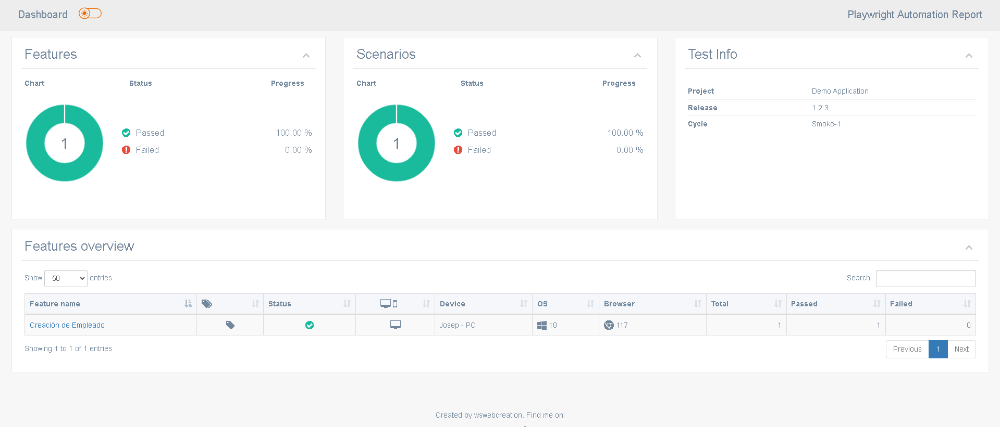
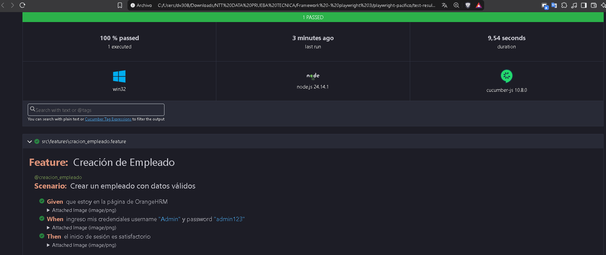

# Automatización Frontend con Playwright, Cucumber y TypeScript

## Proceso de Instalación y Configuración del Entorno
Para poner en marcha el proyecto, realicé los siguientes pasos:
1. **Instale las dependencias:** Ejecuté el comando `npm install` para descargar todas las librerías necesarias del proyecto.
2. **Instalación de navegadores:** Ejecuté `npx playwright install` debido a que Playwright requiere y utiliza sus propios binarios de navegadores para la ejecución de las pruebas. Durante este proceso, los errores de descarga (código 400) se mitigaron automáticamente por el servidor de respaldo Akamai.

## Ejecución de Pruebas y Scripts
Basándome en la documentación técnica, la ejecución debe gestionarse a través de los scripts configurados en el archivo `package.json`.
* Intenté ejecutar inicialmente con el comando `npm test`, obteniendo un error en los primeros intentos debido a que no tenía un comando genérico "test" configurado en el archivo.
* Para solucionar esto, revisé los scripts disponibles ejecutando `npm run`, lo que me mostró los scripts de navegadores y entornos distintos:
  - `test-dev`: Ejecuta en entorno de desarrollo (`dev`) usando Google Chrome
  - `test-uat`: Ejecuta en entorno UAT usando Google Chrome
  - `test-firefox`: Ejecuta en entorno de desarrollo usando Mozilla Firefox
  - `test-webkit`: Ejecuta en entorno de desarrollo usando WebKit

Finalmente, ejecuté el comando **`npm run test-dev`**, el cual indicó que se utilizaría el navegador Google Chrome, logrando una ejecución exitosa y generando el reporte HTML en la carpeta de resultados.

## Estructura y Arquitectura del Proyecto
* **Patrón de diseño:** Se aplicó **Page Object Model (POM)** para separar la lógica de negocio de los localizadores de la UI, centralizar y reutilizar código para mantener los tests limpios y fáciles de mantener
* **Organización de archivos:**
  - `src/features/`: Escenarios de prueba definidos en lenguaje Gherkin
  - `src/step-definitions/`: Implementación de los pasos `Given`/`When`/`Then`
  - `src/pages/`: Clases POM que encapsulan los localizadores y acciones sobre la interfaz gráfica
  - `config/cucumber.js`: Archivo de configuración para el comportamiento de Cucumber

## Evidencia de Ejecución

